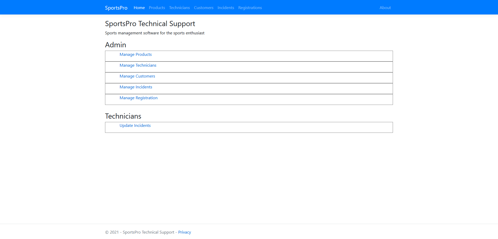
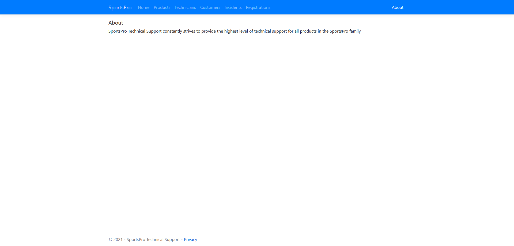
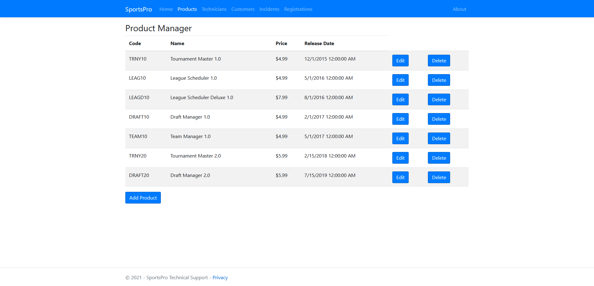
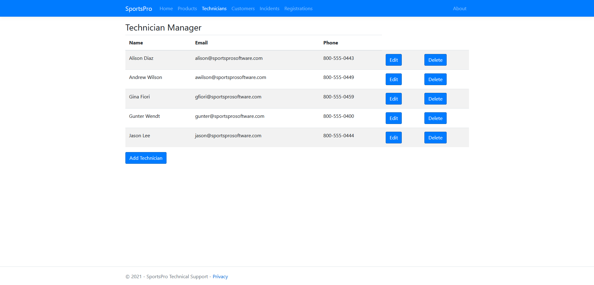
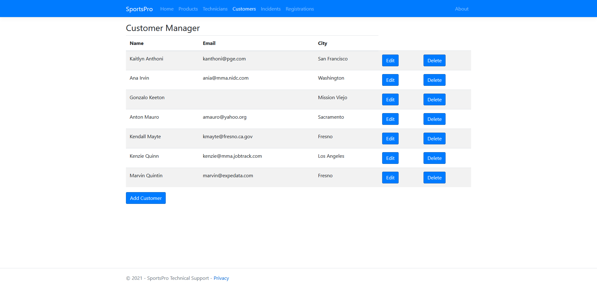
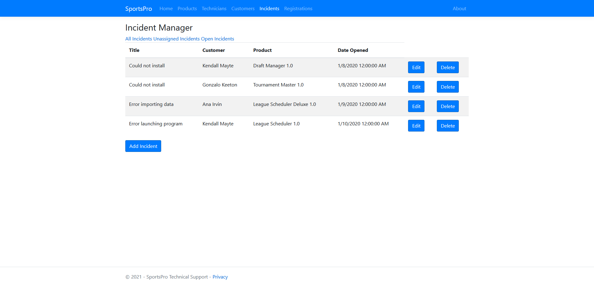

# ASP.NET Core MVC Sports Web App
----------------------------------------

###### Description

Project uses ASP.NET (Visual Studio), C#, IIS (IIS Express), and SQL Server (SQL Express) technologies to develop a web app.
This web app is designed for a fictious tech support department of a software company. The web app will track incidents (service calls),
customers, technicians, products and product registrations in a database.

----------------------------------------

###### Installation & Run Guide

* Requires (Visual Studio) and necessary Visual Studio dependencies

* Clone repository

* Open project ( .sln file ) with Visual Studio

* Build and Run

----------------------------------------

-----------------------------------------

###### Operations

* Home page with navigation bar to other pages

* CRUD operatiosn on products, technicians and customers

* CRUD operations on incidents (includes a customer, and can be resolved by a technician)

* CRUD operations on registrations (includes a customer and product)

###### Validations

* Necessary validatino checks on input fields when creating products, technicians, customers, incidents and registrations